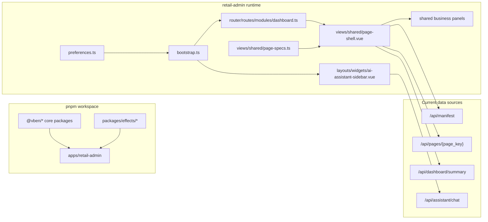

# Black Tonny Frontend Architecture

This document is the primary architecture reference for `black-tonny-frontend`.

It explains:

- what this repository owns in the split frontend/backend model
- how the current `retail-admin` app is composed
- where page data comes from today
- which responsibilities belong to the frontend layer

For topic-level detail, use [docs/README.md](./docs/README.md).

## Repository Role

`black-tonny-frontend` is the page-layer repository for Black Tonny.

Its current responsibilities are:

- provide the `retail-admin` application shell on top of `vue-vben-admin v5`
- own page routing, page composition, and shared business panels
- own theme preferences, layout behavior, and presentation-level interaction rules
- own the layout-level AI assistant sidebar and page-context-to-chat presentation bridge
- render the current dashboard experience from backend page payloads, dashboard summary responses, and assistant chat replies

The frontend is still in a mixed transition stage:

- main page payloads now load through backend `manifest/pages` APIs
- dashboard summary and assistant chat already run through backend APIs
- bootstrap sample files are still useful for local UI work and backend bootstrap fallback, but they are no longer the formal frontend runtime source

## Runtime Overview

## Layered Structure

### 1. Workspace and base packages

The repository uses a `pnpm workspace` structure so that framework-level capabilities and business-facing page composition are not collapsed into a single application directory.

Important layers:

- `@vben/*`
  - base preferences, layouts, utilities, and framework integrations
- `packages/effects/*`
  - environment-dependent capabilities such as request, layouts, and plugins
- `apps/retail-admin`
  - the current Black Tonny business application

Business-facing frontend work should usually happen in `apps/retail-admin` unless a real shared-base change is required.

### 2. Bootstrap and shell

Frontend startup begins in `apps/retail-admin/src/bootstrap.ts`.

The bootstrap path currently:

- initializes the component adapter
- initializes the form adapter
- installs Element Plus
- initializes i18n, stores, directives, router, and motion plugins
- keeps the document title synchronized through `preferences`

Global behavior should enter through this bootstrap path instead of being reintroduced ad hoc inside page components.

### 3. Route-to-page flow

The current business page entrypoints are defined in `src/router/routes/modules/dashboard.ts`.

Runtime flow:

1. a route resolves to a page component
2. the page passes its `pageKey` into `page-shell.vue`
3. `page-shell.vue` reads the corresponding `PageSpec`
4. `PageSpec` decides:
   - hero mode
   - shell kind
   - summary priority
   - primary chart
   - table order
   - default expanded and collapsed blocks
5. `page-shell.vue` either renders the standard shell or delegates to a shared shell renderer such as `dashboard`
6. shared panels render the data without inventing separate page systems

This means `PageSpec + page-shell + shared components` is the core page model of the current frontend.

### 3.5. Layout-level assistant flow

The current app shell also includes a layout-level right-side AI assistant sidebar.

Its current behavior is:

- the layout owns the sidebar frame, desktop docking, mobile drawer fallback, and top-right entry button
- each page pushes already-loaded page context into the shared assistant state
- the frontend submits chat prompts to the backend `POST /api/assistant/chat` contract
- a local rule-based fallback still exists only for unavailable-backend local development scenarios
- a future real DeepSeek or streaming backend can replace the provider step without reworking the layout slot or page-context bridge

### 4. Shared component layer

Shared business panels live under `apps/retail-admin/src/components/*`.

Examples include:

- summary card groups
- execution panels
- consulting panels
- health-light panels
- relationship panels

These components should:

- render already-shaped payload fragments
- follow the established Black Tonny page language
- tolerate empty states, missing fields, and partial payloads

They should not:

- redefine business metrics
- change API contracts
- duplicate backend-owned calculations

## Data Flow

### Current page payload path

The main business page data path currently lives in `apps/retail-admin/src/api/black-tonny.ts`.

Current flow:

1. `loadBlackTonnyManifest()` requests `GET /api/manifest`
2. `loadBlackTonnyPayload(pageKey)` reads `available_pages` from the manifest response
3. the page payload is requested from `GET /api/pages/{page_key}`

Important implication:

- main Black Tonny page payloads now go through the shared request layer
- the frontend runtime no longer directly reads `public/data/*`
- repo-owned page payload fixtures now live under `apps/backend-mock/fixtures/pages`, while formal runtime page payloads come from backend APIs
- when frontend must move before backend route delivery, mock routes should first be defined in `apps/backend-mock`, rather than ad hoc page-level mock builders or frontend-local contract directories

This is already the formal runtime source-of-truth path.

### Current summary API path

Dashboard summary is already separated from the local page-payload path:

- `loadDashboardSummary()` calls `GET /api/dashboard/summary`

Today, the frontend runtime consumes backend API data for:

- manifest and page payloads
- dashboard summary cards
- right-side assistant chat replies

### Request-layer status

The repository still includes `apps/retail-admin/src/api/request.ts` and the `@vben/request` infrastructure for standard framework-level flows such as auth, menus, and user info.

The main Black Tonny page payload path now also depends on that request client.

That means the formal data path is aligned with the repo request standard again.

### Current auth path

The current frontend auth path keeps the official `vben` request/store chain, and the formal auth source of truth is the sibling backend `/api/auth/*` and `/api/user/info` contract:

- login, access-code, and user-info requests all continue through formal `/api/auth/*` and `/api/user/info`
- the sibling backend now owns the formal auth contract and canonical runtime behavior
- `apps/backend-mock/api/auth/*` and `apps/backend-mock/api/user/info.ts` remain only as the single-owner local dev/test fallback
- router guard and access bootstrap still reuse the same `auth store + access store + user store` chain
- business runtime APIs such as `manifest`, `pages`, `dashboard summary`, and `assistant chat` remain formal `/api/*` routes, whether the provider is local `backend-mock` or the sibling backend

The frontend still uses `frontend` access mode for route generation, and local single-repo development still remains runnable through the `backend-mock` fallback without changing the formal auth source of truth.

## Theme and UI Contract

### `preferences.ts` is the theme entrypoint

`apps/retail-admin/src/preferences.ts` is the formal entrypoint for global theme and layout preferences.

It currently owns:

- default home path
- content compactness and layout width
- sidebar and header behavior
- primary theme color
- light-mode and semi-dark choices

Global-looking theme behavior should start there instead of being hard-coded across page-level styles.

### Adapter and UI-library boundary

Element Plus is the current UI component library, but the business layer does not connect to the application shell only through direct component usage.

The adapter layer lives in:

- `src/adapter/component`
- `src/adapter/form.ts`
- `src/adapter/vxe-table.ts`

That layer maps framework abstractions into the current concrete UI implementation and helps keep the page layer aligned with the `vben` base system.

## Frontend Ownership

The frontend owns:

- page routing and page entrypoints
- page composition through `PageSpec`, `page-shell`, and shared panels
- visual hierarchy, presentation pacing, and empty-state behavior
- theme preferences and layout presentation
- right-side assistant layout behavior and page-context chat presentation
- display-side type handling and payload tolerance

The frontend does not own:

- summary metric semantics
- compare-range and date-range calculation logic
- capture-side audit logic
- `capture` / `serving` database modeling
- rebuild, transform, and batch lifecycle logic

When a change affects both page presentation and backend metric semantics, the backend contract should lead and the frontend rendering should follow it.

## Related Docs

- [docs/README.md](./docs/README.md)
- Optional sibling backend architecture:
  - `../black-tonny-backend/ARCHITECTURE.md`
